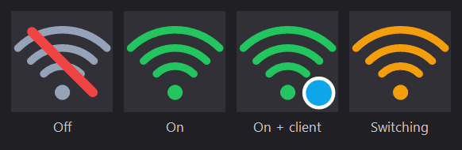

# WiFi Hotspot Tray

**English** | [简体中文](README.zh-CN.md)


Turns the built-in Windows Mobile Hotspot into a tray icon: right-click to toggle, double-click to switch, live client count. It also fixes the thing that quietly ruins the feature — **Windows kills the hotspot after 5 minutes when nothing is connected.**

No .NET SDK, no Node.js, no third-party binaries. Just Windows PowerShell and WinForms.



## Why this exists

If you have ever tried to share your laptop's Wi-Fi, you probably hit one of these two walls.

**Most existing tools are built on a dead API.** The classic `netsh wlan set hostednetwork` approach (and every GUI built on it — VirtualRouter, mHotspot, various batch scripts) requires the legacy Hosted Network capability. Intel and other vendors removed it from their drivers years ago. Check yours:

```powershell
netsh wlan show drivers | Select-String 'Hosted network supported'
```

`No` means those tools will fail on your machine. They are not broken; the ground moved. This project uses the modern tethering API instead, so it works where they cannot.

**Even when it works, the hotspot turns itself off.** With no client connected, Windows shuts it down after about 5 minutes. You enable the hotspot, walk over to your phone, and it is gone. The switch that controls this is not on the default COM interface, so PowerShell cannot call it directly — this project reaches it through reflection and turns it off for good.

## Requirements

- Windows 10 or 11
- **Windows PowerShell 5.1** — `%SystemRoot%\System32\WindowsPowerShell\v1.0\powershell.exe`
- A Wi-Fi adapter with Wi-Fi Direct support (anything from the last decade)
- No administrator rights needed

> **Do not run this with PowerShell 7 (`pwsh`).** The WinRT async projection depends on `System.Runtime.WindowsRuntime`, which PS7 does not ship. Calls fail. The `install.ps1` shortcuts already use the correct engine.

## Quick start

```powershell
git clone https://github.com/huajuan-labs/wifi-hotspot-tray.git
cd wifi-hotspot-tray

# Create desktop shortcuts and generate icons
powershell.exe -NoProfile -ExecutionPolicy Bypass -File .\install.ps1

# Start the tray app
powershell.exe -NoProfile -ExecutionPolicy Bypass -WindowStyle Hidden -File .\HotspotTray.ps1
```

Then right-click the tray icon. The icon may land in the overflow area (`^`) first — drag it onto the taskbar to pin it.

To also have the icon appear at login and the hotspot turn on automatically:

```powershell
powershell.exe -NoProfile -ExecutionPolicy Bypass -File .\install.ps1 -WithAutoStart -WithAutoHotspot
```

The auto-start entry waits up to 180 seconds for the network to come up before enabling the hotspot, because at login Wi-Fi is usually not connected yet.

## Tray menu

```
Turn hotspot on
Turn hotspot off
────────────
Status: on (0/8 clients)        ← refreshes every 3 seconds
Connection details…             ← SSID, password, connected devices
────────────
Start tray at login             ← restores the icon only
Enable hotspot at login         ← turns the hotspot on too
────────────
Exit
```

The icon reflects state: grey with a red slash when off, green when on, green with a blue dot when clients are connected, amber while switching.

## Command line

`hotspot.ps1` does everything the tray does, without a UI:

| Command | What it does |
|---|---|
| `-Status` | Print state, SSID, password, band, and connected devices |
| `-On` | Start the hotspot (also disables the auto-off timeout) |
| `-Off` | Stop the hotspot |
| `-On -Ssid X -Passphrase Y` | Start it with a new name and password |
| `-On -WaitForNetwork` | Wait for connectivity first, up to 180s (`-NetworkTimeoutSeconds` to change) |
| `-Off` / `-On` / `-Status` / `-Watch` | `-Watch` keeps re-enabling the hotspot if something turns it off, until Ctrl+C |

All commands need the 5.1 engine:

```powershell
powershell.exe -NoProfile -ExecutionPolicy Bypass -File .\hotspot.ps1 -Status
powershell.exe -NoProfile -ExecutionPolicy Bypass -File .\hotspot.ps1 -On
powershell.exe -NoProfile -ExecutionPolicy Bypass -File .\hotspot.ps1 -Off
```

## How it works

**Starting and stopping** goes through the modern tethering API rather than the dead hosted-network one:

```powershell
[Windows.Networking.NetworkOperators.NetworkOperatorTetheringManager, Windows.Networking.NetworkOperators, ContentType = WindowsRuntime]::CreateFromConnectionProfile($profile)
```

**Disabling the 5-minute timeout** needs reflection, because `NoConnectionsTimeout` lives on `INetworkOperatorTetheringManager2` while PowerShell binds to the older default interface:

```powershell
$managerType.GetMethod('IsNoConnectionsTimeoutEnabled').Invoke($manager, @())
$managerType.GetMethod('DisableNoConnectionsTimeout').Invoke($manager, @())
```

The setting persists in the registry:

```
HKLM\SYSTEM\CurrentControlSet\Services\icssvc\Settings\PeerlessTimeoutEnabled = 0
```

**Watching it die?** These logs tell the story:

```powershell
Get-WinEvent -LogName 'Microsoft-Windows-WLAN-AutoConfig/Operational' -MaxEvents 20
# 8006 hosted network started / 8008 hosted network stopping
```

## Customization

**Colors.** Copy `hotspot-icon.example.json` to `hotspot-icon.json`, edit, restart the tray app:

```json
{
  "On": "#22C55E",
  "Off": "#94A3B8",
  "Slash": "#EF4444",
  "Badge": "#0EA5E9",
  "Transition": "#F59E0B"
}
```

**Whole icons.** Drop `hotspot-on.png` / `hotspot-off.png` (or `.ico`) next to the script and the tray uses those instead of drawing its own.

**Regenerate the preview image** for the docs:

```powershell
powershell.exe -NoProfile -ExecutionPolicy Bypass -File .\HotspotTray.ps1 -PreviewIcons
```

## Troubleshooting

**My phone cannot see the hotspot.** Check `-Status` first — if `State` is `Off`, the hotspot is simply not running. If it is on and still invisible, the band is the usual culprit: when the upstream Wi-Fi sits on a DFS channel (5 GHz channels 52–144), some phones will not list a hotspot on that channel. Forcing 2.4 GHz improves compatibility at the cost of throughput.

**Everything fails with "Hosted network supported: No".** That is expected and is exactly why this project exists — it does not use that API. If you see this error from *another* tool, that tool cannot work on your hardware.

**The tray icon never appears.** It is probably in the overflow area (`^`). To pin it: right-click the taskbar → Taskbar settings → Other system tray icons → enable it. Failures are written to `hotspot-tray.log` next to the script.

**The hotspot still dies after 5 minutes.** Something else re-enabled the timeout — most likely you toggled the hotspot from the Settings app rather than from this tool. Both entry points here re-disable it every time they start the hotspot.

## Uninstall

```powershell
powershell.exe -NoProfile -ExecutionPolicy Bypass -File .\install.ps1 -Uninstall
```

Removes the shortcuts, including the ones in your Startup folder. Code files stay put. The registry value above is left alone; delete it (or re-enable the timeout in Settings) if you want the stock behavior back.

## Verified on

Tested end to end on Windows 11 (build 26200) with an Intel Wireless-AC 9560, including the case that matters: **all commands, the tray app, and the reflection call work with a non-elevated token**, so double-clicking a desktop shortcut is enough.

## Limitations

- A single Wi-Fi adapter serving as both uplink and hotspot time-slices the radio, so throughput drops while clients are active
- 8 clients maximum — a Windows limit, not ours
- Client device names are not always available; sometimes only MAC and hostname
- Windows Mobile Hotspot is NAT-only. Clients sit behind the PC on a separate subnet (`192.168.137.0/24`) and are not members of the upstream LAN

## License

[MIT](LICENSE)
